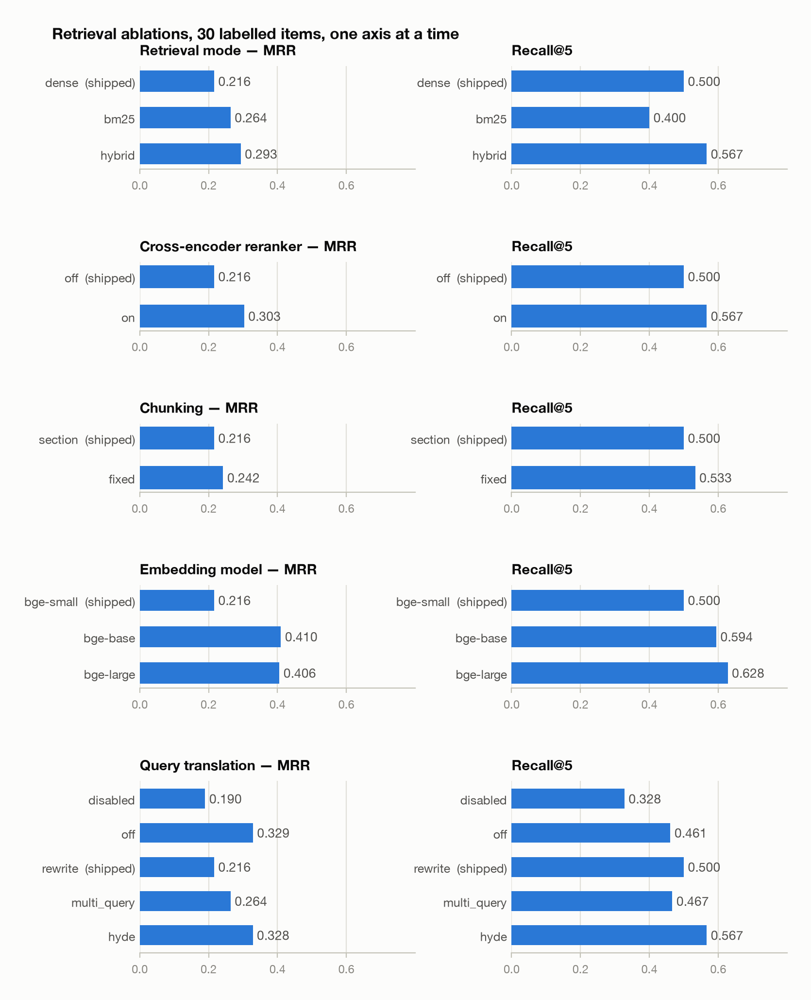
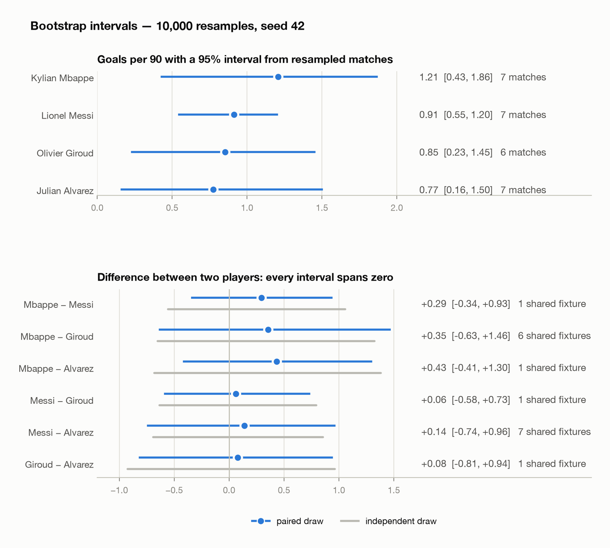

<div align="center">

# TactiStat

**An agentic RAG system for football questions: computed numbers, cited
explanations, in Vietnamese or English.**

[](https://github.com/tchoang11/fb-tactistat/actions/workflows/ci.yml)
[](pyproject.toml)
[](LICENSE)
[](REPORT.md)

</div>



TactiStat answers questions about the **2022 FIFA World Cup** by sending each one
to the right source. A **statistics tool** computes numbers from 234,637
StatsBomb events; a **retrieval tool** finds passages in 318 Wikipedia articles;
a router decides which of the two a question needs, or both. Every number in an
answer comes from a computation, every explanation carries a page-and-section
citation, and a mechanical guard rejects an answer that breaks either rule.

The system is measured, not just built: a 45-question bilingual test set grades
every stage separately, six ablation axes test the retrieval design one change
at a time, and player comparisons come with bootstrap confidence intervals.
[REPORT.md](REPORT.md) states what the numbers do and do not support.

## Highlights

- **Route, then compute or retrieve.** A few-shot router labels each question
  `STAT`, `TACTICAL` or `HYBRID` and fills validated slots (player, metric,
  operation, per-90, filters). It scores 1.000 on labels and slots; a keyword
  baseline scores 0.822 and 0.711.
- **Numbers are computed, never recalled.** Goals, assists, xG, passes and
  per-90 rates come from pandas over the event table, with the supporting
  matches attached. Every stats value in the test set matches its label exactly.
- **Every claim is checked before it is shown.** Each clause must cite a
  retrieved passage or restate a number the tool computed, digit for digit and
  bound to the right metric. What fails is shown as *unverified*, never as an
  answer.
- **Uncertainty is part of the answer.** A per-90 comparison reports a 95%
  interval from resampling each player's matches, paired for fixtures both
  played. No pair among the tournament's leading scorers is separable.
- **Measured, stage by stage.** Translation, routing, stats, retrieval, the
  guard and an independent LLM judge each get their own metric. There is no
  composite score, because a wrong route and a missed passage need different
  fixes.
- **Ablations with a control.** Retrieval mode, reranking, chunking, embedding
  model, query translation and the router are each swept one at a time. The
  shipped configuration, reached from five different sweeps, reproduces to six
  decimals.
- **Bilingual by design.** Questions arrive in Vietnamese or English; the corpus
  is English. A translation stage is part of the pipeline and part of the
  evaluation, and answers come back in the asker's language.

## Results at a glance

Shipped configuration, all 45 items, judge on a different provider and model
family from synthesis. Full tables, per-item artifacts and the caveats are in
[REPORT.md](REPORT.md).

| Stage | Metric | Score | n |
| --- | --- | ---: | ---: |
| Translation | source-language accuracy | 1.000 | 45 |
| Router | label accuracy · slot accuracy | 1.000 · 1.000 | 45 |
| Stats tool | exact match with the labelled value | 1.000 | 30 |
| Retrieval | Recall@5 · MRR | 0.500 · 0.216 | 30 |
| Synthesis guard | mechanical evidence checks passed | 0.689 | 45 |
| Independent judge | correctness · completeness · faithfulness | 0.878 · 0.750 · 0.927 | 45 · 45 · 41 |

The deterministic stages are solved; retrieval is the bottleneck, and the
ablations say what moves it:

| Change against the shipped configuration | ΔMRR | ΔRecall@5 | Cost |
| --- | ---: | ---: | --- |
| Encoder `bge-small` → `bge-base` | **+0.194** | +0.094 | +4 ms p50 retrieval |
| Literal translation instead of a rewrite | +0.113 | −0.039 | none measured |
| Cross-encoder reranker on | +0.087 | +0.067 | 12 ms → 169 ms p50 |
| Hybrid dense + BM25 instead of dense | +0.077 | +0.067 | one extra local search |
| Fixed windows instead of section chunks | +0.026 | +0.033 | inside the noise of 30 items |

<p align="center">

</p>

The guard is stricter than correctness in a specific way: of the 14 answers it
rejected, 8 spelled a correct number as a word, 5 left a sentence uncited, and
none contained a number the tool had not computed. It is also narrower: run
behind a deliberately worse router, its score does not move while judged
correctness falls from 0.878 to 0.722, because a tool asked the wrong question
still returns numbers that check out.

## How it works

```
                        user question (vi | en)
                                  │
                      ┌───────────▼───────────┐
                      │       translate        │  one self-contained English query
                      └───────────┬───────────┘
                      ┌───────────▼───────────┐
                      │         route          │  STAT / TACTICAL / HYBRID + validated slots
                      └─────┬───────────┬─────┘
                            │           │             HYBRID runs both, concurrently
                 ┌──────────▼───┐   ┌───▼──────────┐
                 │  stats tool  │   │   rag tool   │
                 │ pandas over  │   │ bge + BM25   │
                 │ 234k events  │   │ over 5,073   │
                 │ + bootstrap  │   │ chunks       │
                 └──────────┬───┘   └───┬──────────┘
                      ┌─────▼───────────▼─────┐
                      │       synthesize       │  cited answer in the asker's language, or an abstention
                      └───────────┬───────────┘
                      ┌───────────▼───────────┐
                      │     evidence guard     │  numbers digit-for-digit, clauses attributed, citations real
                      └────────────────────────┘
```

| Stage | What it does | Where |
| --- | --- | --- |
| Translate | Vietnamese or English question → one English retrieval query, resolved against the last turns of a conversation; `off`, `rewrite`, `multi_query` and `hyde` strategies | [`query_translation/`](src/tactistat/query_translation/) |
| Route | Few-shot classifier with structured output; every slot validated and repaired against the configured metrics; a keyword baseline for the ablation | [`router/`](src/tactistat/router/) |
| Stats tool | Per-player, per-match tables rebuilt from the event stream; per-90 rates; leaderboards, comparisons, totals; match-resampled bootstrap intervals | [`stats_tool/`](src/tactistat/stats_tool/) |
| RAG tool | Section-aware chunking budgeted in the encoder's own tokens; FAISS, BM25 or rank-fused hybrid retrieval; optional cross-encoder reranking | [`rag_tool/`](src/tactistat/rag_tool/) |
| Synthesis | Answer from tool output only, with `[n]` citations; the guard checks every number and every clause afterwards | [`synthesis/`](src/tactistat/synthesis/) |
| Orchestration | A LangGraph state graph: parallel tools for `HYBRID`, per-thread conversation memory, streaming, LangSmith or local JSONL tracing | [`graph.py`](src/tactistat/graph.py), [`pipeline.py`](src/tactistat/pipeline.py) |
| Evaluation | Strict labelled-set schema, per-stage metrics, an independent judge, checkpointed runs, one-axis ablations | [`eval/`](src/tactistat/eval/) |

Every model is addressed as `provider:alias` through
[`configs/models.yaml`](configs/models.yaml), which records the JSON mode each
model was *measured* to support; eight providers are registered and the shipped
defaults are free tiers. Behaviour is driven by
[`configs/default.yaml`](configs/default.yaml): an experiment is a config diff,
not a code branch.

## Quickstart

Requires Python 3.10–3.12. The steps use [uv](https://docs.astral.sh/uv/); a
plain `venv` and `pip` work the same way.

```bash
git clone https://github.com/tchoang11/fb-tactistat.git
cd fb-tactistat
uv venv --python 3.12 && source .venv/bin/activate
uv pip install -e ".[dev]"

# The processed tables are committed: no API key or download needed
tactistat stats goals --top-n 5
tactistat stats goals "Lionel Messi" "Kylian Mbappe" --per90

# Retrieval needs an index built from the committed corpus (about a minute, once)
tactistat build-index
tactistat search "Morocco Spain round of 16 2022" --mode hybrid --rerank

# Tests, and the labelled set checked against the committed artifacts
pytest tests -q
tactistat evaluate --validate-only
```

Answering questions end to end needs model keys. The defaults are free and need
no card:

| Provider | Role | Sign-up |
| --- | --- | --- |
| Groq | router, synthesis | https://console.groq.com/keys |
| Google Gemini | translator, judge | https://aistudio.google.com/apikey |

```bash
cp .env.example .env            # fill in GROQ_API_KEY and GEMINI_API_KEY
python scripts/probe_models.py  # confirms each configured model is reachable

tactistat ask "Messi ghi bao nhiêu bàn ở World Cup 2022?" --trace
tactistat ask "Why was Morocco so hard to break down at the 2022 World Cup?"
tactistat chat                  # follow-ups resolve against the conversation
```

Alibaba Cloud DashScope, Cerebras, OpenRouter, GitHub Models, OpenAI and a local
Ollama server are also registered; any role can point at any of them with
`--set models.synthesis=provider:alias`.

To rebuild the data from scratch rather than use the committed tables:

```bash
python scripts/01_build_dataset.py          # StatsBomb events, ~30 s, gitignored
python scripts/02_build_corpus.py --force   # Wikipedia crawl, ~90 s
python scripts/03_build_stats.py            # aggregation and minutes reconciliation
```

## Command reference

| Command | Purpose |
| --- | --- |
| `tactistat ask "<question>" [--trace] [--stream] [--strategy S]` | Answer one question; `--trace` prints each stage's decision |
| `tactistat chat` | A conversation; follow-ups such as *"Còn Mbappé?"* resolve against earlier turns |
| `tactistat stats <metric> [players...] [--per90] [--top-n N] [--team T] [--stage S]` | The stats engine directly: a player, a comparison with intervals, or a leaderboard |
| `tactistat search "<query>" [--mode dense\|bm25\|hybrid] [--rerank]` | The retriever directly, with page, section and revision for every passage |
| `tactistat bootstrap <metric> <players...>` | Every interval behind a comparison, with seed, resample count and match ids |
| `tactistat evaluate [--validate-only] [--limit N] [--id ID] [--no-judge] [--rejudge REPORT]` | The labelled set, end to end or label validation only |
| `tactistat ablate <axis>` | One axis, arms side by side: `retrieval_mode`, `rerank`, `chunking`, `embedding`, `translation`, `translation_uncached`, `translation_uncached_single`, `router`, `baseline` |
| `tactistat build-data \| build-corpus \| build-stats \| build-index` | Rebuild each data artifact |
| `python scripts/04_plot_results.py` | Redraw every figure from the committed artifacts |
| `python scripts/render_demo.py` | Re-render the terminal demo above from [`docs/demo/session.json`](docs/demo/session.json) |

Any config value can be overridden per run with `--set key=value`, and an
experiment config can be layered with `--config`. Every report records the
effective configuration it ran under.

## Evaluation

[`eval/test_set.json`](eval/test_set.json) holds 45 questions, 15 each for
`STAT`, `TACTICAL` and `HYBRID`, with Vietnamese and English items in every
group. Numeric labels are pinned to the processed tables and re-derived before
every run; retrieval labels name a Wikipedia page, section and content anchor, so
they survive a change of chunking strategy.

```bash
tactistat evaluate --validate-only                     # labels vs. committed artifacts, no model calls
tactistat --set tracing.enabled=false evaluate         # full run with the independent judge
tactistat ablate retrieval_mode                        # dense | bm25 | hybrid
tactistat ablate embedding                             # bge-small | bge-base | bge-large
tactistat bootstrap goals "Kylian Mbappe" "Lionel Messi" "Olivier Giroud" "Julian Alvarez"
```

Runs are checkpointed after every item, so a provider outage is recorded rather
than averaged. A stage that ran and found nothing scores zero; a stage that could
not run is excluded from the metric *and* from latency, and every such count
reaches the exit code. The per-item half of every published table is committed
under [`eval/results/runs/`](eval/results/runs/), and each ablation artifact
embeds the full base configuration, so any arm can be rebuilt as base plus its
overrides.

<p align="center">

</p>

A World Cup gives a player three to seven matches, so a per-90 rate carries
real sampling error. Each player's matches are resampled 10,000 times; for two
players who met, the shared fixtures are drawn once and handed to both, which
keeps the covariance between them. Pairing tightens the interval for opponents
who met in a high-scoring final and *widens* it for two forwards in the same XI,
who split their team's goals rather than score them together.

## Design notes

The reasoning behind the design, and the bugs that shaped it, is in
[docs/design-notes.md](docs/design-notes.md). A few of the decisions:

- **Decoding modes are measured, not assumed.** On Groq only the `gpt-oss`
  family accepts strict JSON schema; the Llama checkpoints reject it with HTTP
  400. The registry records what each model really supports, so an invalid
  route label is impossible rather than unlikely.
  → [Model registry](docs/design-notes.md#model-registry-and-measured-decoding-modes)
- **Support is checked per clause.** "Morocco pressed high [1] and France won
  the tournament" cites a passage and is still half invented; a bracket covers
  the text before it, up to the previous bracket, which is how prose actually
  cites. Attribution is proven mechanically; entailment is measured by a judge
  from another model family.
  → [The evidence guard](docs/design-notes.md#router-slots-and-the-evidence-guard)
- **Minutes are rebuilt from the event stream.** The lineup positions field
  puts twelve Iran players on the pitch at once; substitutions, dismissals and
  stoppage-time clipping reconcile to `22 × match length` in all 64 matches.
  → [Minutes played](docs/design-notes.md#minutes-played-and-why-they-are-not-read-off-the-lineups)
- **Chunks are budgeted in the encoder's own tokens, prefix included.** A
  sentence-transformer given more than its window truncates silently; 11.5% of
  sections exceed it, and an earlier chunker pushed 70 chunks over the limit by
  prefixing the title after splitting.
  → [Retrieval index](docs/design-notes.md#retrieval-index)
- **Hybrid retrieval fuses ranks, not scores.** A BM25 score is unbounded and a
  cosine lives in [-1, 1]; a weighted sum means something different for every
  query. Reciprocal rank fusion asks only how highly each retriever placed a
  document.
- **The LLM cache holds an ablation fixed.** Within a retrieval axis every arm
  receives byte-identical translated queries, which is what makes arms
  comparable, and also why every absolute number is conditioned on one draw of
  the translator. A second, uncached draw measures that band directly.
  → [Ablation harness](docs/design-notes.md#ablation-harness)
- **Memory is opt-in.** `ask` is isolated and `chat` names a thread, so an
  evaluation sweep cannot leak one answer into the next question.
  → [The graph](docs/design-notes.md#the-graph)

## Repository layout

```
configs/
  default.yaml        the shipped system; every ablation is a diff against it
  models.yaml         provider and model registry with measured capabilities
src/tactistat/
  cli.py              every command above
  config.py           defaults -> experiment config -> --set overrides
  pipeline.py         the stages and the result they build
  graph.py            LangGraph state graph over the stages
  tracing.py          LangSmith with a key, local JSONL without one
  llm/registry.py     handle -> chat model, with the measured decoding mode
  query_translation/  any-language question -> English retrieval queries
  router/             question -> label + validated tool slots
  stats_tool/         minutes, aggregation, per-90, queries, bootstrap intervals
  rag_tool/           chunking, index, dense / bm25 / hybrid retrieval, reranking
  synthesis/          tool evidence -> cited answer, plus the evidence guard
  eval/               labelled-set schema, metrics, judge, runner, ablations
  data/               StatsBomb ingestion and the Wikipedia crawl
eval/
  test_set.json       45 labelled questions
  results/ablations/  one artifact per axis, base config embedded
  results/runs/       per-item scores, guard notes, judge rationales
  results/figures/    drawn from the artifacts above
  results/bootstrap.json
data/processed/       committed tables and corpus (see its README)
docs/                 design notes and the terminal demo
scripts/              data builds, model probe, figures, demo renderer
tests/                483 tests: data integrity, stats, retrieval, pipeline, evaluation
```

## Data and licences

- **StatsBomb open data**, 2022 FIFA World Cup: 64 matches, 234,637 events,
  complete xG coverage. Used under the
  [StatsBomb open data licence](https://github.com/statsbomb/open-data/blob/master/LICENSE.pdf);
  the raw download is gitignored and reproduced by one script. The load is
  validated against facts from outside the dataset: 172 goals against the
  official record, per-team goals against every scoreboard, the top scorers,
  and the shootout kicks that StatsBomb records as ordinary shots.
- **Wikipedia**, 318 articles scoped from the event data: the 32 teams, 243
  players, the tournament pages and a curated set of tactical concepts. Text is
  CC BY-SA 4.0; page title, URL and revision id are stored with every record and
  cited in every answer.
- **Code** is MIT, see [LICENSE](LICENSE).

## Limitations and next steps

- Retrieval numbers rest on 30 labelled items and one draw of the translator;
  differences under about 0.05 MRR between translating arms are not established.
- The base-sized encoder is the strongest lever found and the first change the
  next iteration should make, followed by a rerun of the study on it.
- The guard fails a fifth of answers on orthography (a correct number spelled as
  a word); relaxing that would raise the headline number without changing an
  answer, which is why no single aggregate is quoted.
- The test set is thin where the pipeline is weakest: three `compare` items,
  one `per90`, one `opponent`. Widening it invalidates comparison with every
  table in the report, so it is a deliberate next step rather than a patch.
